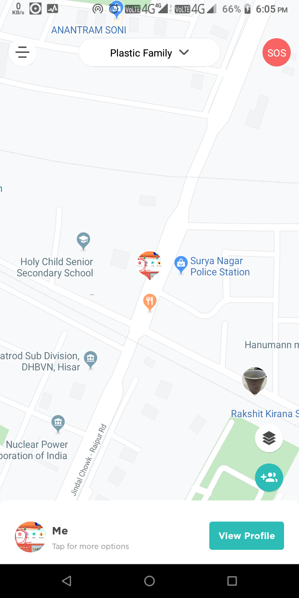

# Fs-locator

Fs-locator is a user tracking system used for tracking family members' mobile location in the background and showing it on the map. So that they can track each other.
 
This app is developed in 2 different languages (English and Portuguese).
 
It is developed using <b>react.js, react-native, redux, redux-saga and socket.io</b>
 

### ScreenShot:-

Figure : Home

 

